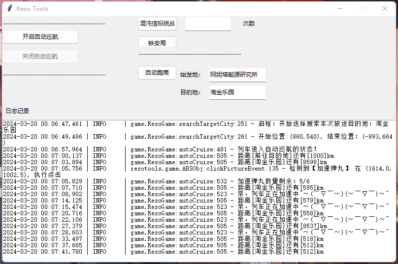

<!--
 * @Author: Achetair
 * @Date: 2024-03-11 22:12:32
 * @LastEditors: Achetair
 * @LastEditTime: 2024-03-20 22:41:46
 * @Description: 
-->
# resotools
 
雷索纳斯游戏小助手，禁止商用，自用脚本。

# 部署环境

* python 3.11.8，mumu模拟器，1920x1080
* 在python的环境的Lib\site-packages下面添加mypath.pth，并写入项目的父目录(运行不需要，改功能需要)
* 安装相关依赖 
* 运行 <code>python mainApp.py</code>

# 更新计划

- [x] 自动巡航（虽然官方出了，但是感觉好贵）

- [x] 混响信标：把车子开到树下面，到挑战页面，体力准备好，就可以挂机了

- [x] 自动铁安局

- [x] 半自动跑商:输入起始地和目的地，全买全卖，不讲价，不买书。7号自由港不是七号自由港。

- [ ] 自动化日常

- [ ] 自定义配置文件

# 说明

* 不讲价：讲价疲劳8，买卖讲价2次（4*8=32）。后期一趟利润一般就15w，花疲劳讲价如果收益大于一趟的数，就可以。不过偷懒的话，可以直接放着来回跑就行。

* 地图查询：用矩阵做地图，城市位置坐标化，然后计算拖拽就行了。

# 运行截图

# 打包

nuitka --mingw64 --windows-disable-console --standalone --enable-plugin=tk-inter mainApp.py

nuitka --mingw64 --windows-disable-console --enable-plugin=tk-inter ResoToolsUI.py